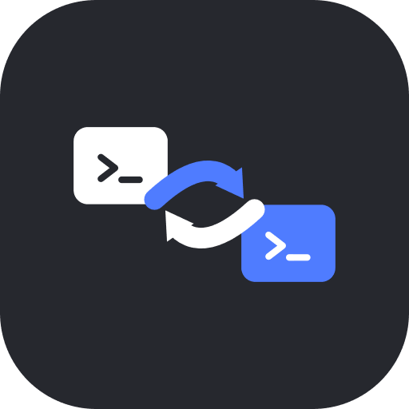

<div align="center">
  

  # claude-desktop-swap

  [](https://github.com/FranCalveyra/claude-desktop-swap/actions/workflows/ci.yml)
  [](https://github.com/FranCalveyra/claude-desktop-swap/releases/latest)
  [](go.mod)
  [](LICENSE)
</div>

Switch between multiple Claude Desktop accounts without logging out of any of them.

## How it works

Claude Desktop is an Electron app whose root `Cookies` SQLite database is the authoritative local session evidence. `claude-desktop-swap` stores that database as a named profile and swaps it only after Claude and its helper processes have fully stopped.

Before restoring the incoming profile, a switch checkpoints the currently tracked outgoing profile. This preserves cookie refreshes made since the previous switch. Local Storage, IndexedDB, and Session Storage are volatile account caches: they are cleared after replacement so Claude can rebuild them from the restored cookies.

## Installation

Download the latest binary for your platform from the [releases page](../../releases/latest).

**macOS (Apple Silicon)**
```sh
curl -L https://github.com/FranCalveyra/claude-desktop-swap/releases/latest/download/claude-desktop-swap_darwin_arm64.tar.gz | tar xz
sudo mv claude-desktop-swap /usr/local/bin/
```

**macOS (Intel)**
```sh
curl -L https://github.com/FranCalveyra/claude-desktop-swap/releases/latest/download/claude-desktop-swap_darwin_amd64.tar.gz | tar xz
sudo mv claude-desktop-swap /usr/local/bin/
```

### Build from source

```sh
go install github.com/FranCalveyra/claude-desktop-swap@latest
```

## Usage

```sh
# Save your current session as a named profile (quit Claude first)
claude-desktop-swap save personal

# Add another account interactively — no manual logout required
claude-desktop-swap add work

# Switch to a saved profile (kills and restarts Claude Desktop)
claude-desktop-swap use work

# List all saved profiles (* = active)
claude-desktop-swap list

# Show the currently active profile and how long its session has left
claude-desktop-swap status

# Same, but report through the exit code: 0 healthy, 1 expiring soon, 2 expired
claude-desktop-swap status --check

# Delete a profile
claude-desktop-swap delete old-account
```

## First-time setup

1. Make sure you're logged into Claude Desktop as your first account. Quit Claude Desktop, then snapshot it:
   ```sh
   claude-desktop-swap save personal
   ```
2. Add a second account — `add` snapshots `personal`, clears the slate, opens Claude for you to log in, and saves the new session:
   ```sh
   claude-desktop-swap add work
   ```
3. Repeat `add <name>` for any additional accounts.

From here on, switching is one command:

```sh
claude-desktop-swap use personal
claude-desktop-swap use work
```

> **Important:** Never manually log out of Claude Desktop to set up a new account — Anthropic invalidates the session server-side and the snapshot becomes useless. Always use `add` or `save` to capture a session **before** any logout.

`save`, including `save --force`, refuses to snapshot while Claude is running. A quiescent database is required for a safe WAL checkpoint.

## Profile storage

Profiles are stored at `~/.claude-swap/profiles/<name>/` and contain:

| File | Contents |
|------|----------|
| `Cookies` | SQLite copy of your session cookies |
| `meta.json` | Non-secret format, identity, local health, timestamp, and integrity metadata |

Version 2 profiles contain only these two files. Directories use `0700`; files use `0600`. Cookie values are never selected, decrypted, printed, or logged.

Version 1 profiles remain readable without eager migration. A locally usable v1 profile restores normally and becomes v2 only after its next successful outgoing checkpoint. Expired or incomplete v1 profiles cannot be repaired from legacy Local Storage or IndexedDB data; sign in again and save a fresh profile.

Health is based on non-secret local SQLite evidence and is reported as `usable`, `expired`, `missing`, or `unknown`. Expired, missing, unknown, unsafe, or integrity-mismatched profiles are never restored. Server-side expiry cannot be extended by this tool.

The active profile is tracked at `~/.claude-swap/current`, but `status` reports a profile name only when live Cookies actually match a usable saved profile.

## Session expiry

`list`, `status`, and the `use` picker show an `EXPIRES` column derived from the `sessionKey` cookie's own expiry, and `save`/`use` print a warning when a session has 7 days or less left. The `sessionKey` is a sliding ~28-day token that Claude renews whenever you use that account, so reaching the 7-day window means the profile has gone roughly three weeks untouched.

Expiry is advisory, never a block: a session expiring tomorrow is still perfectly usable and still switches. A profile shows `-` when no deadline is known — a non-persistent cookie or an unreadable database — and no warning is invented from missing data. When the server has already rejected a session, that verdict wins over whatever the local cookie claims.

`status --check` exits `0` when healthy, `1` when the session expires within 7 days, and `2` when it has expired, so it can drive a shell prompt or a cron job.

## Switch safety and preserved data

A switch follows: target preflight → verified full stop → outgoing WAL checkpoint and atomic profile commit → staged incoming replacement → volatile-cache clearing → active tracking → launch. Interrupted profile writes retain the previous generation for recovery. A failed incoming replacement rolls back live Cookies and does not report success. If launch fails after commit, the incoming profile remains active and Claude can be opened manually.

Only `Cookies`, `Cookies-journal`, `Cookies-wal`, `Cookies-shm`, `Local Storage/leveldb`, `IndexedDB`, and `Session Storage` participate in session replacement or cache clearing. Global and machine state—including `config.json`, `WebStorage`, `partitions`, and `ant-did`—is preserved.

## Platform support

| OS | Status |
|----|--------|
| macOS | Supported |
| Windows | Planned |

## Security

Cookie values are encrypted by Chromium using your OS keychain. `claude-desktop-swap` never decrypts them — it copies raw encrypted blobs, which are only usable on the machine where they were created.

Profile directories are created with `0700` permissions and profile files with `0600`. Restoration refuses broader permissions.
